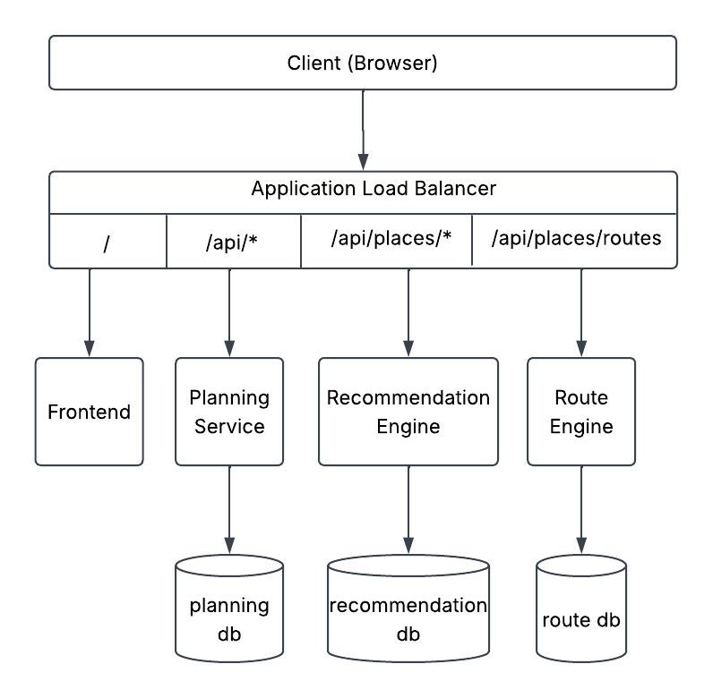
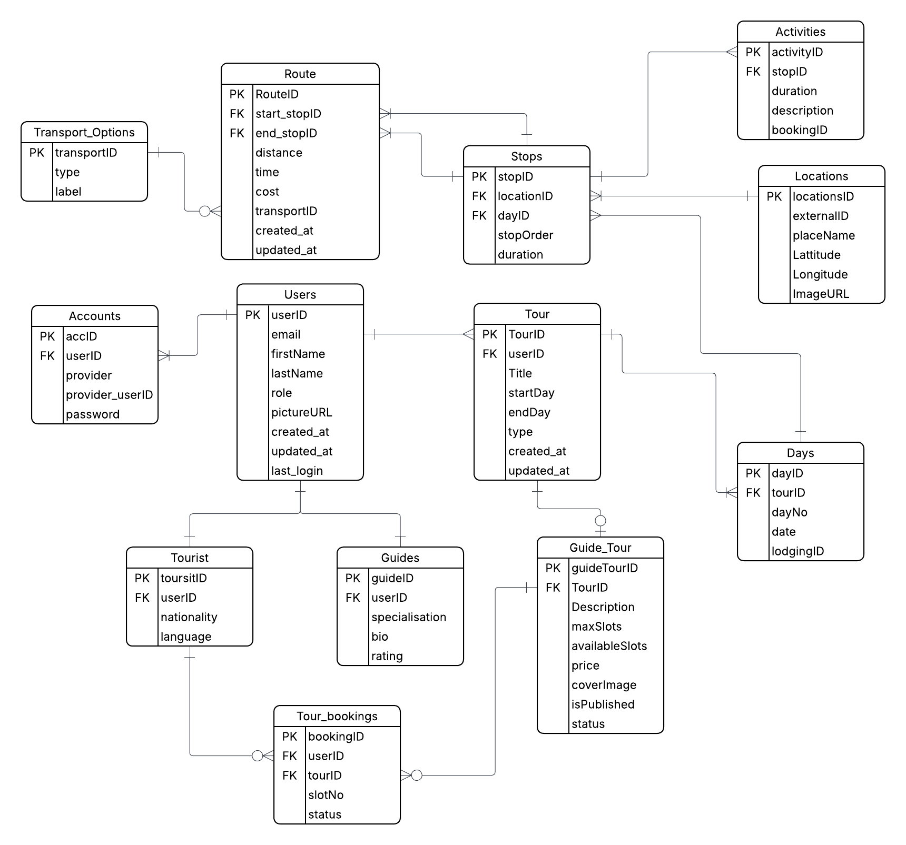
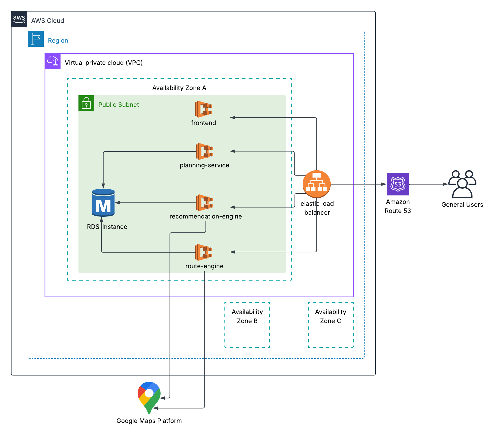

# TourSL

TourSL is a full-stack tour planning platform built for Sri Lanka. It allows tourists to plan multi-day itineraries — adding stops, activities, and routes between destinations — while guides can create and publish tour packages for tourists to book. The platform integrates Google Places and Google Routes APIs for place discovery and route calculation, with intelligent caching to minimize API costs.

---

## Table of Contents

- [Architecture Overview](#architecture-overview)
- [Planning Service](#planning-service)
- [Recommendation Engine](#recommendation-engine)
- [Route Engine](#route-engine)
- [Testing](#testing)
- [Deployment](#deployment)
- [Getting Started](#getting-started)
- [Future Plans](#future-plans)

---

## Architecture Overview

TourSL follows a microservices architecture with four independently deployable services communicating through an Application Load Balancer.



### Service Responsibilities

| Service | Role |
|---------|------|
| **Frontend** | React SPA — tour planning UI, map interactions, user dashboards |
| **Planning Service** | Core business logic — auth, tours, days, stops, activities, routes, bookings, guide packages |
| **Recommendation Engine** | Place discovery — text search and nearby search via Google Places API with DB caching |
| **Route Engine** | Route calculation — multi-modal directions via Google Routes API with DB caching |

### Tech Stack Summary

| Layer | Technologies |
|-------|-------------|
| Frontend | React 19, TypeScript, Vite, Tailwind CSS, React Router |
| Backend (Core) | Java 17, Spring Boot 4.1, Spring Security, JPA/Hibernate, Flyway |
| Backend (Python) | Python 3.11, FastAPI, SQLAlchemy (async), asyncpg, Alembic |
| Database | PostgreSQL 16 |
| Infrastructure | AWS ECS Fargate, ALB, RDS, ECR, GitHub Actions |
| Auth | JWT (access + refresh tokens), Google OAuth 2.0 |
| External APIs | Google Places API (New), Google Routes API |

---

## Planning Service

The planning service is the core backend — it handles authentication, tour lifecycle, and all CRUD operations for the itinerary domain.

### Tech Stack

- **Language:** Java 17
- **Framework:** Spring Boot 4.1
- **ORM:** Spring Data JPA / Hibernate
- **Database Migrations:** Flyway
- **Security:** Spring Security + JWT (access & refresh tokens) + Google OAuth 2.0
- **Build Tool:** Maven (with Maven Wrapper)

### Project Structure

```
planning-service/
├── src/main/java/com/tourplanner/planning/
│   ├── auth/               # Authentication & authorization
│   │   ├── controller/     # AuthController (register, login, OAuth, refresh)
│   │   ├── entity/         # User, Account, Tourist, Guide, Role, AuthProvider
│   │   ├── repository/     # UserRepository, AccountRepository, etc.
│   │   ├── security/       # JwtUtil, JwtAuthenticationFilter, CustomUserDetailsService
│   │   └── service/        # AuthService
│   ├── tour/               # Tour & Day management
│   │   ├── controller/     # TourController, DayController, GuideTourPackageController
│   │   ├── entity/         # Tour, Day, TourType, GuideTourPackage, PackageStatus
│   │   ├── repository/
│   │   └── service/
│   ├── stop/               # Stops & Activities
│   │   ├── controller/     # StopController, ActivityController
│   │   ├── entity/         # Stop, Activity
│   │   ├── repository/
│   │   └── service/
│   ├── route/              # Routes between stops
│   │   ├── controller/     # RouteController
│   │   ├── entity/         # Route, TransportOption
│   │   ├── repository/
│   │   └── service/
│   ├── location/           # Location management
│   │   ├── entity/         # Location
│   │   ├── repository/
│   │   └── service/
│   ├── booking/            # Tour package bookings
│   │   ├── controller/     # BookingController
│   │   ├── entity/
│   │   ├── repository/
│   │   └── service/
│   └── config/             # TourAccessValidator, SecurityConfig
├── src/main/resources/
│   ├── application.yml
│   └── db/migration/       # Flyway SQL migrations (V1–V8)
└── src/test/java/          # Unit & integration tests
```

### API Endpoints

#### Authentication (`/api/auth`)

| Method | Endpoint | Description |
|--------|----------|-------------|
| POST | `/api/auth/tourist/register` | Register a tourist (email + password) |
| POST | `/api/auth/tourist/google` | Register/login tourist via Google OAuth |
| POST | `/api/auth/guide/register` | Register a guide |
| POST | `/api/auth/guide/google` | Register/login guide via Google OAuth |
| POST | `/api/auth/login` | Login with email + password |
| POST | `/api/auth/refresh` | Refresh access token |

#### Tours (`/api/tours`)

| Method | Endpoint | Description |
|--------|----------|-------------|
| POST | `/api/tours` | Create a new tour (auto-generates Day entries) |
| GET | `/api/tours/{tourId}` | Get tour by ID with all days |
| GET | `/api/tours/my-tours` | Get all tours for authenticated user |
| PUT | `/api/tours/{tourId}` | Update tour dates (regenerates days if changed) |
| DELETE | `/api/tours/{tourId}` | Delete tour and all associated data |

#### Days (`/api/days`)

| Method | Endpoint | Description |
|--------|----------|-------------|
| GET | `/api/days/{dayId}` | Get day with stops |
| GET | `/api/days/tour/{tourId}` | Get all days for a tour |
| PUT | `/api/days/{dayId}` | Update day (lodging) |
| PUT | `/api/days/{dayId}/clear` | Clear all stops and lodging from day |

#### Stops (`/api/stops`)

| Method | Endpoint | Description |
|--------|----------|-------------|
| POST | `/api/stops` | Add a stop to a day |
| GET | `/api/stops/{stopId}` | Get stop with activities |
| GET | `/api/stops/day/{dayId}` | Get all stops for a day (ordered) |
| PUT | `/api/stops/{stopId}` | Update stop (duration, location) |
| PUT | `/api/stops/day/{dayId}/reorder` | Reorder stops within a day |
| PUT | `/api/stops/{stopId}/move` | Move stop to a different day |
| DELETE | `/api/stops/{stopId}` | Delete a stop |

#### Activities (`/api/activities`)

| Method | Endpoint | Description |
|--------|----------|-------------|
| POST | `/api/activities` | Add activity to a stop |
| GET | `/api/activities/{activityId}` | Get activity by ID |
| GET | `/api/activities/stop/{stopId}` | Get all activities for a stop |
| PUT | `/api/activities/{activityId}` | Update activity |
| DELETE | `/api/activities/{activityId}` | Delete activity |

#### Routes (`/api/routes`)

| Method | Endpoint | Description |
|--------|----------|-------------|
| POST | `/api/routes` | Create route between two stops |
| GET | `/api/routes/{routeId}` | Get route by ID |
| GET | `/api/routes/day/{dayId}` | Get all routes for a day |
| PUT | `/api/routes/{routeId}` | Update route (transport, distance, time) |
| DELETE | `/api/routes/{routeId}` | Delete a route |
| DELETE | `/api/routes/day/{dayId}` | Delete all routes for a day |

#### Guide Tour Packages (`/api/guide-packages`)

| Method | Endpoint | Description |
|--------|----------|-------------|
| GET | `/api/guide-packages/tour/{tourId}` | Get package for a guide's tour |
| PUT | `/api/guide-packages/tour/{tourId}` | Update package details (description, price, slots) |
| GET | `/api/guide-packages/my-packages` | Get all packages for authenticated guide |
| GET | `/api/guide-packages/published` | Get all published packages (public) |

#### Bookings (`/api/bookings`)

| Method | Endpoint | Description |
|--------|----------|-------------|
| POST | `/api/bookings` | Book a guide tour package |
| GET | `/api/bookings/my-bookings` | Get bookings for authenticated user |
| GET | `/api/bookings/package/{packageId}` | Get all bookings for a package |

### Database Schema

Managed by Flyway with 8 versioned migrations. Key tables:



**Key constraints:**
- Unique stop order per day (`uq_stops_day_order`)
- Unique route per start-end stop pair (`uq_route_start_end`)
- Cascade deletes: Tour → Days → Stops → Activities
- Tour ownership enforced at service layer via `TourAccessValidator`

### Design Decisions

| Decision | Approach |
|----------|----------|
| **Race Conditions in Bookings** | Optimistic locking via JPA `@Version` — concurrent slot decrements trigger `OptimisticLockException` instead of overbooking. No pessimistic locks needed. |
| **Payment Timer** | 15-minute payment window with `@Scheduled` expiry job. Slots are reserved immediately but auto-released if unpaid — prevents indefinite slot deadlocks. |
| **Centralized Access Control** | `TourAccessValidator` enforces ownership + modifiability in one place. All write operations resolve to the parent tour and pass through `verifyOwnershipAndModifiable()`. Guide tours lock once published. |
| **Route Invalidation on Reorder** | Captures old consecutive stop pairs, compares after mutation, deletes only invalidated routes — selective cleanup instead of brute-force deletion. |
| **Two-Phase Reorder** | Unique constraint on `(day_id, stop_order)` prevents naive swaps. Solution: assign negative intermediary values → flush → assign correct positives → flush. Atomic within one transaction. |
| **Tour Date Overlap Prevention** | JPQL interval overlap query (`A.start ≤ B.end AND A.end ≥ B.start`) catches all overlap cases in a single check. |
| **Package State Machine** | `DRAFT → PUBLISHED → FILLED` with strict transition rules. Editing locked after publish, auto-transitions on cancellation/slot changes. |
| **Duplicate Booking Prevention** | Repository-level `existsBy` check prevents double-bookings from retries/rapid clicks, while still allowing re-booking after cancellation. |

---

## Recommendation Engine

A lightweight Python service that wraps the Google Places API (New) and caches results in PostgreSQL to minimize API costs and improve response times.

### Tech Stack

- **Language:** Python 3.11
- **Framework:** FastAPI
- **ORM:** SQLAlchemy 2.0 (async) + asyncpg
- **Database Migrations:** Alembic
- **External API:** Google Places API (New) — Text Search & Nearby Search

### Project Structure

```
recommendation-engine/
├── app/
│   ├── main.py              # FastAPI app entrypoint
│   ├── api/routes/places.py # API endpoints
│   ├── core/config.py       # Pydantic settings (env vars)
│   ├── db/
│   │   ├── base.py          # SQLAlchemy base
│   │   └── session.py       # Async session factory
│   ├── models/
│   │   ├── location.py      # Cached location model
│   │   ├── query_location.py# Query-location join
│   │   └── search_query.py  # Cached search query model
│   ├── schemas/place.py     # Pydantic response schemas
│   └── services/
│       ├── google_places.py # Google Places API client
│       └── cache.py         # Cache read/write logic
├── alembic/                 # Database migrations
├── requirements.txt
└── Dockerfile
```

### API Endpoints

| Method | Endpoint | Description |
|--------|----------|-------------|
| GET | `/api/places/search?query=...&max_results=20` | Text search for places (e.g. "temples in Kandy") |
| GET | `/api/places/nearby?lat=...&lng=...&radius=5000&types=...&max_results=20` | Nearby place search by coordinates |

### Response Schema

```json
{
  "results": [
    {
      "id": "google_place_id",
      "name": "Sigiriya Rock Fortress",
      "address": "Sigiriya, Sri Lanka",
      "location": { "latitude": 7.957, "longitude": 80.760 },
      "rating": 4.7,
      "user_rating_count": 12500,
      "types": ["tourist_attraction", "landmark"],
      "photo_url": "https://..."
    }
  ],
  "count": 1
}
```

### Design Decision: Hash-Based Location Caching (3-Table Normalized Schema)

Every search request is cached to avoid redundant Google Places API calls (billed per request). The DB uses 3 tables:

- **`search_queries`** — stores the SHA256 `query_hash` of search params + `expires_at` (24h TTL)
- **`locations`** — stores place data (name, coordinates, rating, types, photo). Keyed by `google_place_id` (unique)
- **`query_locations`** — junction table linking queries to locations with a `rank` column (preserves result order)

**Cache flow:**

1. **Hash** — Serialize search params (query text, lat/lng, radius, types, max_results), sort, SHA256 hash
2. **Lookup** — Find matching `query_hash` in `search_queries` where `expires_at > now`
3. **Hit** — Join through `query_locations` → `locations`, return results in ranked order
4. **Miss** — Call Google Places API, **upsert** locations by `google_place_id` (updates stale data), insert new `search_queries` row with 24h expiry, link via `query_locations`

The normalized schema means locations are shared across queries — if "temples in Kandy" and "things to do in Kandy" both return Sigiriya, only one location record exists, always kept fresh on each cache write.

---

## Route Engine

A Python service that wraps the Google Routes API to compute multi-modal directions between two coordinates, caching results to reduce API usage.

### Tech Stack

- **Language:** Python 3.11
- **Framework:** FastAPI
- **ORM:** SQLAlchemy 2.0 (async) + asyncpg
- **Database Migrations:** Alembic
- **External API:** Google Routes API — Compute Routes

### Project Structure

```
route-engine/
├── app/
│   ├── main.py                  # FastAPI app entrypoint
│   ├── api/routes/directions.py # API endpoint
│   ├── core/config.py           # Pydantic settings
│   ├── db/
│   │   ├── base.py
│   │   └── session.py
│   ├── models/cached_route.py   # Cached route model
│   ├── schemas/route.py         # Request/response schemas
│   └── services/
│       ├── google_routes.py     # Google Routes API client
│       └── cache.py             # Cache read/write logic
├── alembic/                     # Database migrations
├── requirements.txt
└── Dockerfile
```

### API Endpoints

| Method | Endpoint | Description |
|--------|----------|-------------|
| POST | `/api/route-engine/directions` | Compute routes between origin and destination |

### Request / Response

**Request:**
```json
{
  "origin": { "latitude": 7.957, "longitude": 80.760 },
  "destination": { "latitude": 7.291, "longitude": 80.636 },
  "travel_modes": ["DRIVE", "TWO_WHEELER"]
}
```

**Response:**
```json
{
  "options": [
    {
      "travel_mode": "DRIVE",
      "distance_meters": 115000,
      "duration_seconds": 7200,
      "summary": "Via A9 highway",
      "polyline": "encoded_polyline_string"
    }
  ]
}
```

If `travel_modes` is omitted, defaults to `["DRIVE", "TWO_WHEELER", "WALK"]`.

### Design Decision: Coordinate-Rounded Route Caching with Mode-Specific TTLs

Route API calls are expensive and routes between similar points rarely differ. The caching strategy accounts for this:

1. **Coordinate rounding** — Origin and destination lat/lng are rounded to 3 decimal places (~111m precision) before lookup. Two requests 50m apart hit the same cache entry instead of triggering separate API calls
2. **Cache check** — Query `cached_routes` for matching rounded coordinates + travel mode where `expires_at > now`
3. **All-or-nothing** — Cache only returns a hit if results exist for **all** requested travel modes. Partial cache = full refetch, ensuring consistent data
4. **Mode-specific TTLs** — Different route types change at different rates:

| Mode | TTL | Rationale |
|------|-----|-----------|
| WALK | 30 days | Pedestrian paths rarely change |
| BICYCLE | 14 days | Bike routes are mostly stable |
| DRIVE / TWO_WHEELER | 7 days | Road conditions change moderately |
| TRANSIT | 24 hours | Bus/train schedules change frequently |

---

## Testing

### Planning Service Tests

The planning service has comprehensive unit and integration tests using:

- **JUnit 5** — test framework
- **Mockito** — mocking dependencies for unit tests
- **Spring Boot Test** — `@WebMvcTest` for controller tests
- **Spring Data JPA Test** — `@DataJpaTest` for repository integration tests
- **AssertJ** — fluent assertions

#### Test Categories

| Category | Annotation | What's tested |
|----------|-----------|---------------|
| Service (unit) | `@ExtendWith(MockitoExtension.class)` | Business logic with mocked repositories |
| Controller (slice) | `@WebMvcTest` | HTTP layer, request/response mapping, security |
| Repository (integration) | `@DataJpaTest` | JPA queries, constraints, cascades against real PostgreSQL |
| Security (unit) | `@ExtendWith(MockitoExtension.class)` | JWT generation/validation, filter chain |

#### Running Tests

```bash
cd planning-service

# Run all tests (requires PostgreSQL — see docker-compose.yml or CI config)
./mvnw test

# Run only unit tests (no DB required)
./mvnw test -Dtest="*ServiceImplTest,*ControllerTest"

# Run a specific test class
./mvnw test -Dtest="TourServiceImplTest"
```

#### Test Coverage

- **Service tests:** Tour, Day, Stop, Activity, Route — all CRUD operations + edge cases
- **Controller tests:** Request validation, auth enforcement, response mapping
- **Repository tests:** Constraint violations, cascade behavior, query correctness, data isolation between users
- **Security tests:** JWT token lifecycle, authentication filter, user details loading

### CI Pipeline

Tests run automatically on every push to `main` via GitHub Actions with a PostgreSQL service container:

```yaml
services:
  postgres:
    image: postgres:15
    env:
      POSTGRES_DB: testdb
      POSTGRES_USER: test
      POSTGRES_PASSWORD: test
```

---

## Deployment

TourSL is deployed on AWS using a containerized, serverless approach.



### Infrastructure

| Component | Service | Purpose |
|-----------|---------|---------|
| Compute | ECS Fargate | Runs 4 containerized services (no servers to manage) |
| Load Balancing | Application Load Balancer | Path-based routing to services |
| Database | RDS PostgreSQL 16 (db.t4g.micro) | Single instance, 3 databases |
| Container Registry | ECR | Stores Docker images per service |
| CI/CD | GitHub Actions | Automated test → build → deploy pipeline |

### How It Works

1. **CI/CD Pipeline** — On every push to `main`, GitHub Actions builds all 4 Docker images in parallel (matrix strategy), pushes to ECR as `:latest`, then forces an ECS service redeploy
2. **ALB Path-Based Routing** — A single Application Load Balancer routes requests by path: `/api/places/*` → recommendation-engine, `/api/route-engine/*` → route-engine, `/api/*` → planning-service, everything else → frontend
3. **ECS Fargate Tasks** — Each service runs as a Fargate task (256 CPU / 512 MB) with public IPs in public subnets. No EC2 instances to manage
4. **RDS PostgreSQL** — One `db.t4g.micro` instance hosts 3 isolated databases (`planning_db`, `recommendation_db`, `route_db`). Not publicly accessible — only reachable from the backend security group
5. **Security Groups** — Layered network isolation: ALB accepts port 80 from the internet, backend containers only accept traffic from ALB, RDS only accepts connections from backend containers. Frontend has no network path to RDS at all

### Key Design Decisions

- **One RDS instance, three databases** — Cost-effective for a portfolio project; each service has credentials only to its own database
- **No NAT Gateway** — Services run in public subnets with public IPs; RDS is locked down via security groups (no public access). Saves ~$30/month
- **Separate security groups** — Frontend container has no network path to RDS (defense in depth)
- **Health check grace period (180s)** — Spring Boot takes ~135s to start on Fargate's 256 CPU; without this, ECS kills the task before it's ready
- **SSL required for Python services** — `asyncpg` requires explicit `?ssl=require` in connection strings to reach RDS (JDBC connects without it)

## Getting Started

### Prerequisites

- Java 17+
- Node.js 18+
- Python 3.11+
- PostgreSQL 15+
- Docker & Docker Compose

### Run with Docker Compose

```bash
docker compose up --build
```

This starts all 4 services + PostgreSQL locally.

### Run Individually

```bash
# Planning Service
cd planning-service
# Set DB_URL, DB_USER, DB_PASSWORD in .env
./mvnw spring-boot:run

# Frontend
cd frontend
npm install && npm run dev

# Recommendation Engine
cd recommendation-engine
pip install -r requirements.txt
# Set DATABASE_URL, GOOGLE_PLACES_API_KEY in .env
uvicorn app.main:app --port 8000

# Route Engine
cd route-engine
pip install -r requirements.txt
# Set DATABASE_URL, GOOGLE_ROUTES_API_KEY in .env
uvicorn app.main:app --port 8002
```

---

## Future Plans

- [ ] **Route Engine → Optimization Engine** — Evolve from simple A→B routing into a trip optimizer: single-day TSP (optimal stop order via brute-force/nearest-neighbor) and full-trip optimization (cluster stops into days, then optimize within each day)
- [ ] **Recommendation Engine → Personalized Recommendations** — Move beyond cached Google Places searches to actual recommendations based on user preferences, travel history, and interests
- [ ] **Frontend to S3 + CloudFront** — Serve the React SPA from S3 with CloudFront CDN instead of running it as a Fargate container
- [ ] **Private subnets + NAT Gateway** — Move services into private subnets with a NAT Gateway for outbound traffic, replacing the current public-subnet + security-group approach for stronger network isolation
